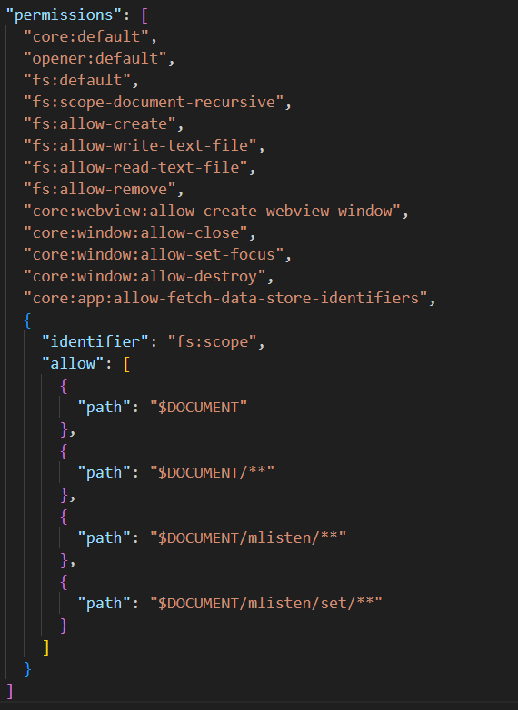

# MListen - Training Your Listening Skills

MListen is a free app that lets you create English vocabulary collection to improve your listening skills. In this app, you can create a new collection to save the word you want to listen to. while listening a word, if you want to learn more about it, you can look up more information about that word by clicking the **_Learn More_** button.

    

Application Interface

## Features
- 🔑**Create a new collection**: 
  - **Number of collections:** Unlimited (If you have more collection, the app's processing speed has decreased).
  - **Requirement for collection's name:** The collection's name must be as required.
  - While creating a new collection, you must follow the requirement below:
    - 👉**Valid name** (The collection name must not match any words that Windows does not allow for file names.)
    - 👉**5 to 40 characters**
    - 👉**Cannot end with a period or space**
    - 👉**Does not contain the following characters: \\ / : * ? \" < > |**

    

<b>Demo App</b>

- 🔑**Delete a collection**: You have two way to delete a collection:
  - **In list collection:** At the top of the list collection, you can see a red button with _**Trash Bin**_ icon. By clicking it, you can delete any collections.
  - **When you choose a collection:** When you choose a collection in the list collection, the collection data will be loaded and you can see a red "**_Delete Collection_**" button. Click it to delete the selected collection.

    

<b>Delete a collection</b>

    

<b>Delete a selected collection</b>

- 🔑**Add a new word:**
  - **Requirement:** You must create a collection first.
  - You press the green "New word" button at the top right of the screen to create a new word.
  - While creating a new word, you must follow the requirement below:
    - ️🎯 The word must exist in the English vocabulary.
    - ️🎯 The word’s transcription must exist.
    - ️🎯 You must choose a value for Part of Speech field. The value contain: noun, verb, adjverb, adverb

    

    

<b>Create a new word</b>

- 🔑**Open Cambridge Dictionary:**
  - While you add a new word, you can press the orange "**Open dictionary**" button to open Cambridge Dictionary for searching.

    

<b>Open Cambridge Dictionary</b>

- 🔑**Delete a word:**
  - You press the red "**Delete word**" button at the top right of the screen to open **Delete Mode**.
  - While opening **Delete Mode**, you choose some words and click delete button.

    

<b>Delete word</b>

- 🔑**Listen mode:**
  - Press the blue "**Listen Mode**" button at the top right screen to activate listen mode.
  - Double-click a word to play it's sound. Some possible cases:
    - Hear **"No sound found"** => MListen can't find the pronunciation of the word.
    - Hear **"You have X sound"** => MListen found **X** pronunciation for that word.
    - Hear the sound of the word.

    

<b>Listen Mode</b>

- 🔑**Learn more:**
  - You must follow the requirement below:
    - You must activate the **Listen Mode** first.
    - You must take double-click a word.

    

<b>Learn More</b>

## Technology stack
- Tauri Framework - File System (Main Plugin).
- React TypeScript.
- Redux Toolkit.
- Tailwind CSS.
- Free Dictionary API.
- Cambridge Dictionary.

## Tauri permissions

    

